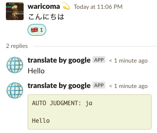
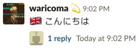
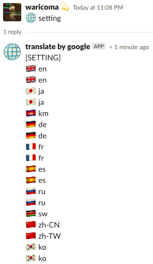
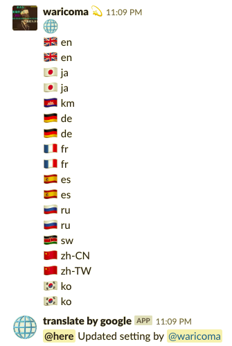
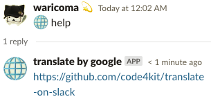

# Translate on Slack

Slack bot with Google Translate.

* * *

## Slack

\*Invite this bot.

### Message Translate



### Post Message with Translate



### Setting



### Overwrite setting



### Help



* * *

## Coding Style

```bash
semistandard --fix
```

* * *

## Commit Style

```bash
npm run-script commit
```

* * *

## DocumentationJS

<!-- Generated by documentation.js. Update this documentation by updating the source code. -->

#### Table of Contents

- [config][1]
- [LANGS][2]
- [LANGS][3]
- [reactionToLang][4]
- [transToThread][5]
  - [Parameters][6]
- [replyToThread][7]
  - [Parameters][8]
- [path][9]
- [SETTING_JSON][10]
- [reaction2lang][11]
- [editing][12]
- [memo][13]
- [update][14]
  - [Parameters][15]
- [request][16]
- [translate][17]
  - [Parameters][18]

### config

**Meta**

- **version**: 1.0.0
- **author**: Motone Adachi (@waritocomatta)

### LANGS

by [https://cloud.google.com/translate/docs/languages][19]

Type: [Array][20]&lt;[string][21]>

### LANGS

by [https://cloud.google.com/translate/docs/languages][19]

Type: [Array][20]&lt;[string][21]>

### reactionToLang

Reaction to Lang for func of 'translate'.

Type: [string][21]&lt;[string][21]>

### transToThread

- **See: replyToThread**

trans to thread.

#### Parameters

- `ch` **[string][21]** 
- `trans` **[object][22]** 
- `ts` **[string][21]** 

### replyToThread

reply to thread.

#### Parameters

- `ch` **[string][21]** 
- `msg` **[string][21]** 
- `ts` **[string][21]** 

### path

**Meta**

- **version**: 1.0.0
- **author**: Motone Adachi (@waritocomatta)

### SETTING_JSON

Type: [string][21]

### reaction2lang

Type: [string][21]&lt;[string][21]>

### editing

Type: [boolean][23]

### memo

Type: [string][21]&lt;[string][21]>

### update

update for reaction to lang.

#### Parameters

- `reaction` **[string][21]** 
- `lang` **[string][21]** 

### request

**Meta**

- **version**: 1.0.0
- **author**: Motone Adachi (@waritocomatta)

### translate

translate

#### Parameters

- `msg` **[string][21]** 
- `lang` **[string][21]** 
- `callback` **[string][21]** 

[1]: #config

[2]: #langs

[3]: #langs-1

[4]: #reactiontolang

[5]: #transtothread

[6]: #parameters

[7]: #replytothread

[8]: #parameters-1

[9]: #path

[10]: #setting_json

[11]: #reaction2lang

[12]: #editing

[13]: #memo

[14]: #update

[15]: #parameters-2

[16]: #request

[17]: #translate

[18]: #parameters-3

[19]: https://cloud.google.com/translate/docs/languages

[20]: https://developer.mozilla.org/docs/Web/JavaScript/Reference/Global_Objects/Array

[21]: https://developer.mozilla.org/docs/Web/JavaScript/Reference/Global_Objects/String

[22]: https://developer.mozilla.org/docs/Web/JavaScript/Reference/Global_Objects/Object

[23]: https://developer.mozilla.org/docs/Web/JavaScript/Reference/Global_Objects/Boolean
