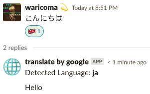

# Translate on Slack

Slack bot with Google Translate.

* * *

## Slack
*Invite this bot.

### Message Translate


### Post Message with Translate


### Setting


### Overwrite setting


### Help


* * *

## Coding Style

```bash
semistandard --fix
```

* * *

## [.commit_template](.commit_template)

```bash
git config commit.template .commit_template
```

by <https://github.com/carloscuesta/gitmoji-cli>

```bash
gitmoji -l
```

* * *

## DocumentationJS

<!-- Generated by documentation.js. Update this documentation by updating the source code. -->

#### Table of Contents

- [config][1]
- [reactionToLang][2]
- [transToThread][3]
  - [Parameters][4]
- [replyToThread][5]
  - [Parameters][6]
- [request][7]
- [LANGS][8]
- [translate][9]
  - [Parameters][10]

### config

**Meta**

- **version**: 1.0.0
- **author**: Motone Adachi (@waritocomatta)

### reactionToLang

Reaction to Lang for func of 'translate'.

Type: [string][11]&lt;[string][11]>

### transToThread

- **See: replyToThread**

trans to thread.

#### Parameters

- `ch` **[string][11]** 
- `trans` **[object][12]** 
- `ts` **[string][11]** 

### replyToThread

reply to thread.

#### Parameters

- `ch` **[string][11]** 
- `msg` **[string][11]** 
- `ts` **[string][11]** 

### request

**Meta**

- **version**: 1.0.0
- **author**: Motone Adachi (@waritocomatta)

### LANGS

Type: [Array][13]&lt;[string][11]>

### translate

translate

#### Parameters

- `msg`  {string}
- `lang`  {'en'|'ja'|'km'}
- `callback`  {function}

[1]: #config

[2]: #reactiontolang

[3]: #transtothread

[4]: #parameters

[5]: #replytothread

[6]: #parameters-1

[7]: #request

[8]: #langs

[9]: #translate

[10]: #parameters-2

[11]: https://developer.mozilla.org/docs/Web/JavaScript/Reference/Global_Objects/String

[12]: https://developer.mozilla.org/docs/Web/JavaScript/Reference/Global_Objects/Object

[13]: https://developer.mozilla.org/docs/Web/JavaScript/Reference/Global_Objects/Array
